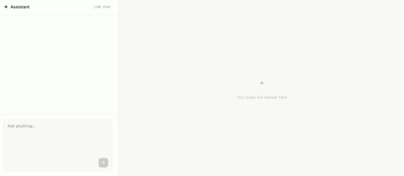

# &lt;vibe-img&gt;

> 🚧 **Beta**

Image generation for prototyping, built for lazy LLMs and lazy developers. Choose your favorite model, bring your own API key.





## Getting Started

### 1. Ask your LLM to use vibe-img

It will include the library:

```html
<script src="https://cdn.jsdelivr.net/npm/vibe-img@1.0.0/dist/vibeimg.js"></script>
```

And generate images with a single tag:

```html
<vibe-img 
  model="recraft" 
  prompt="Miami Beach at sunset">
</vibe-img>
```

> 🚧 **vibe-img is brand new**. Help your LLM get it right — pass the docs: https://www.vibe-img.com/llms.txt


### 2. Add your API keys

Once the page loads, click the ⋯ button on any image to enter your API key.

That's it — images generate automatically and you're ready to ship.

## Why?

Some vibe builders suck at image generation and give you zero control. Others don't even let you try. vibe-img tries to fix that.

Your LLM can generate images, maintain visual consistency across a page with `<vibe-theme>`, chain operations with image references, and switch provider with a single attribute change.

**One API, any provider.** Write the same tag regardless of provider. Switch from `model="openai"` to `model="recraft"` and nothing else changes.

**No wasted tokens on refresh.** Generated images are cached in the browser and on a CDN. A repeated page load never hits the AI provider.

**Share freely**. Generated images are cached on a CDN and served from a public URL — no API key needed to view them.

**Your keys stay yours**. API calls go straight from your browser to the provider — no middleman storing your credentials. See [Security](#security) for details.


> ⚠️ Free CDN cache lasts 1 hour — more than enough for a vibe session. Longer retention is coming soon.

Are you still reading, human? Just ask your LLM to use this library and let it handle the rest.

---

## `<vibe-img>` attributes

| Attribute | Values | Default | Description |
|-----------|--------|---------|-------------|
| `model` | `openai`, `recraft` | — | **Required.** Provider to use. |
| `prompt` | string | — | Text prompt. Required for `generate`, `img2img`, `replace-bg`. |
| `op` | `generate`, `img2img`, `upscale`, `remove-bg`, `replace-bg`, `vectorize` | `generate` | Operation to perform. |
| `aspect` | `square`, `landscape`, `portrait`, `wide`, `tall` | `square` | Output aspect ratio. |
| `img-style` | See [Styles](#styles) | — | Visual style. |
| `quality` | `draft`, `standard`, `hd` | `standard` | Generation quality. |
| `format` | `png`, `webp`, `jpeg` | (provider default) | Output image format. |
| `img-ref` | URL or `#id` | — | Reference image. Required for `img2img`, `upscale`, `remove-bg`, `replace-bg`, `vectorize`. |
| `seed` | integer | — | Reproducible generation (provider support varies). |
| `negative-prompt` | string | — | What to avoid in the image (provider support varies). |
| `params` | JSON string | — | Raw provider params, merged last. Override anything. |
| `alt` | string | — | Alt text for the generated ``. |

> **Note on `model` vs `params.model`:** The `model` attribute selects the **provider** (openai, recraft). To override the specific **API model** within a provider (e.g. `recraftv4`, `gpt-image-1`), use `params='{"model":"recraftv4"}'`.

> ⚠️ **Always use a closing tag.** `<vibe-img />` does **not** work — the HTML parser treats custom elements as open tags when self-closed. Always write `<vibe-img ...></vibe-img>`.

### Styles

These map to native provider style parameters where available, otherwise they're injected into the prompt automatically.

`realistic` · `natural` · `vivid` · `illustration` · `3d` · `pixel` · `anime` · `sketch` · `watercolor` · `oil-painting` · `comic` · `retro` · `cinematic` · `vector` · `minimalist` · `flat` · `icon` · `logo` · `neon` · `fantasy` · `abstract` · `isometric` · `kawaii`

### Operations

| Operation | Required attributes | Description |
|-----------|-------------------|-------------|
| `generate` | `prompt` | Text to image. |
| `img2img` | `prompt`, `img-ref` | Edit an image with a prompt. |
| `upscale` | `img-ref` | Increase resolution. |
| `remove-bg` | `img-ref` | Remove background, returns transparent image. |
| `replace-bg` | `prompt`, `img-ref` | Replace background with prompt. |
| `vectorize` | `img-ref` | Convert to SVG. |

### Provider support

| Operation | `openai` | `recraft` |
|-----------|----------|-----------|
| `generate` | ✓ | ✓ |
| `img2img` | ✓ | ✓ |
| `upscale` | — | ✓ |
| `remove-bg` | — | ✓ |
| `replace-bg` | ✓ | ✓ |
| `vectorize` | — | ✓ |

---

## `<vibe-theme>`

Apply a shared style prompt to a group of images. Closest ancestor wins on nesting.

```html
<vibe-theme prompt="warm editorial, soft lighting, muted earth tones">
  <vibe-img model="recraft" prompt="coffee cup"></vibe-img>
  <vibe-img model="recraft" prompt="open notebook"></vibe-img>

  <vibe-theme prompt="dark cinematic, dramatic shadows">
    <vibe-img model="recraft" prompt="whiskey glass"></vibe-img>
  </vibe-theme>
</vibe-theme>
```

The theme prompt is appended to each child's prompt at generation time. Changing the `prompt` attribute regenerates affected images automatically.

---

## Image references

Use `img-ref` to chain operations. Pass a URL or point to another `<vibe-img>` by ID.

```html
<!-- External URL -->
<vibe-img
  model="recraft"
  op="remove-bg"
  img-ref="https://example.com/photo.jpg"
></vibe-img>

<!-- Reference another vibe-img by ID -->
<vibe-img id="source"
  model="recraft"
  prompt="a cat sitting on a windowsill"
></vibe-img>

<vibe-img
  model="recraft"
  op="upscale"
  img-ref="#source"
></vibe-img>
```

When `img-ref="#id"` is used, the second element waits for the first to finish before starting. Cache lookups for both happen in parallel, so repeated page loads are instant.

---

## Advanced: raw provider params

`params` accepts the original provider API parameters directly — not a vibe-img abstraction. These are merged last and override everything else, so you have full access to whatever the provider supports.

```html
<!-- Recraft: custom brand colors -->
<vibe-img
  model="recraft"
  prompt="company logo"
  params='{"controls":{"colors":[{"rgb":[46,125,50]}]}}'
></vibe-img>

<!-- OpenAI: transparent background -->
<vibe-img
  model="openai"
  prompt="app icon, minimal"
  format="png"
  params='{"background":"transparent"}'
></vibe-img>

<!-- Recraft: use V4 model -->
<vibe-img
  model="recraft"
  prompt="product photo"
  params='{"model":"recraftv4"}'
></vibe-img>

<!-- Recraft: use a provider-specific style via params -->
<vibe-img
  model="recraft"
  prompt="city at night"
  params='{"style":"Neon Calm"}'
></vibe-img>
```

---

## Configuration

### API keys

Configure keys programmatically, as an alternative to the built-in modal:

```js
await VibeImg.configure({
  openai:  'sk-...',
  recraft: 'rk-...',
});
```

Or open the key modal for a specific provider:

```js
VibeImg.openKeyModal('recraft');
```

### Runtime options

```js
VibeImg.setup({
  corsProxyUrl:          'https://your-proxy.com/proxy?url=',
  serverStorageEndpoint: null,    // disable remote caching
  r2PublicUrl:           null,
  useServerStorage:      false,
  requestTimeoutMs:      60_000,
  debug:                 true,    // verbose logs for bug reports
});
```

### Debug mode

Logs every step — cache lookups, key resolution, HTTP requests, polling. Enable before reproducing an issue and include the output in bug reports.

```html
<script type="module">
  VibeImg.setup({ debug: true });
</script>
```

---

## Security

### API key storage

API keys are encrypted with AES-GCM and stored in your browser's IndexedDB — they never leave your device. They're passed directly to the provider on each request. **The only exception is when a CORS proxy is required** (see below), in which case the key passes through the proxy in memory for the duration of the request, then it's gone.

### CORS proxy

Some providers (e.g. OpenAI) don't allow direct browser requests. By default, vibe-img routes those through `api.vibe-img.com/proxy`.

**Your API token passes through this proxy, but is never stored — it exists only in memory for the duration of the request.** The proxy's only job is forwarding. Providers that support CORS (Recraft does) bypass the proxy entirely and call the API directly from the browser.

If you'd rather not trust the default proxy, point vibe-img at your own:

```js
VibeImg.setup({ corsProxyUrl: 'https://your-proxy.com/proxy?url=' });
```

Or disable it entirely:

```js
VibeImg.setup({ corsProxyUrl: null });
```

---

## Development

### Local setup

```sh
git clone https://github.com/user/vibe-img.git
cd vibe-img
npm install
npm run dev       # dev server
npm test          # adapter fixture tests
npm run typecheck
npm run build     
```

### Project structure

```
src/
  adapters/       Model adapters (one file per provider)
  core/           Execution engine
  dom-adapter/    Web component + hooks
  storage/        IndexedDB + server cache
  utils/          Network, hashing, error handling
```

### Adding a provider

Copy `src/adapters/_template.ts`, fill in the mapping tables and `buildRequest()`, write at least 5 fixtures, then register in `src/adapters/index.ts`.

```sh
cp src/adapters/_template.ts src/adapters/my-provider.ts
```

Fixtures cover request building only. It's still recommended to test your adapter against the real API before submitting.

```sh
npm test
```

---

## Contributing

Your favorite provider isn't here? Don't be sad — read a bit of docs, implement an adapter, and join the vibe-img family. It's less work than it sounds. No one is perfect either — found a bug? Open an issue or send a PR.